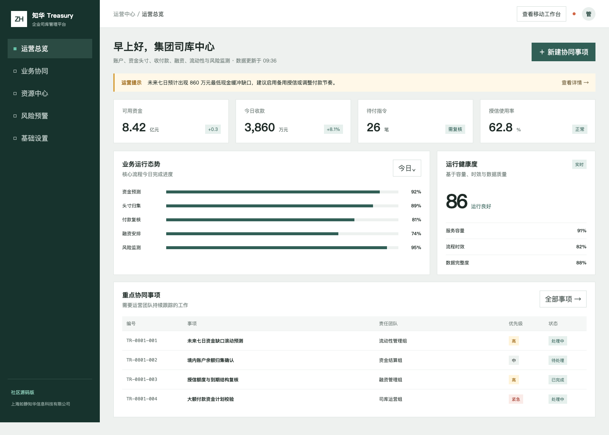
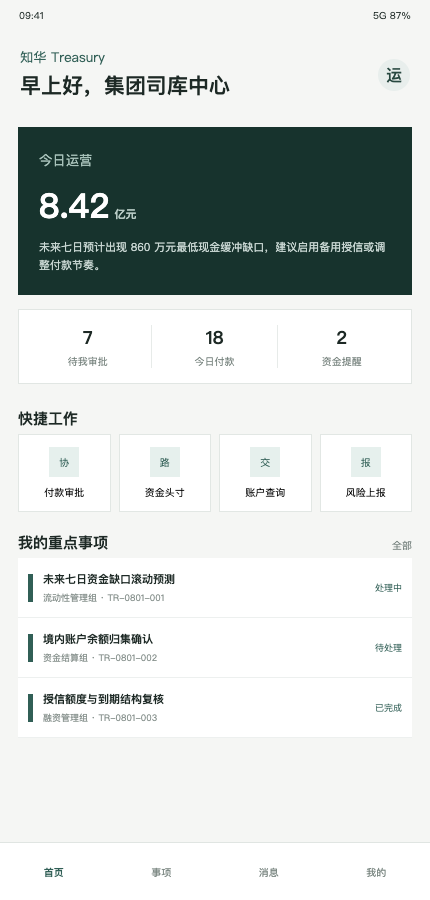

<div align="center">

# 知华 Treasury 企业司库管理平台

**账户 · 资金头寸 · 收付款 · 融资 · 流动性 · 风险监测**

[访问知华科技](https://www.zhuatech.cn/)　/　[查看界面](#界面预览)　/　[部署](#本地部署)　/　[许可](#社区源码许可)

</div>

## 企业级增强：司库付款指令治理

新增收款白名单、账户核验、制裁筛查、流动性、职责分离、金额授权、数字签名和高额付款确认门禁，详见 [付款指令治理](docs/ENTERPRISE_PAYMENT_INSTRUCTION.md)。

---

ZhuaTech Treasury 是上海如静知华信息科技有限公司发布的企业司库社区源码项目。它以七日流动性为切入点，将集团资金态势、付款复核、授信安排和风险事项集中展示，提供 Java + MySQL 后端以及 Vue 管理端和移动审批工作台。

> 使用边界：仅限个人非商业学习、研究与交流。企业内部生产使用及任何形式的商业使用，均需知华科技书面授权。

## 界面预览



管理端侧重可用资金、今日收款、付款指令、授信使用率和资金工作流，不展示真实银行或企业数据。



移动工作台聚焦付款审批、资金头寸、账户查询和风险上报，可继续对接企业审批流。

## 版本 1.0 包含什么

| 模块 | 实现内容 |
| --- | --- |
| 资金驾驶舱 | 可用资金、收款、待付指令、授信使用率 |
| 司库协同 | 资金预测、头寸归集、付款复核、融资安排、风险监测 |
| 流动性覆盖 | 汇总现金、授信、应收、受限资金、到期付款和最低缓冲 |
| 移动办公 | 付款审批、头寸查看、账户查询、风险事项 |
| 工程基线 | Spring Security、JPA、MySQL、统一接口、测试及 Docker Compose |

流动性接口返回 `COVERED / WATCH / GAP` 和行动建议。结果是演示规则，不构成财务、融资、投资或现金管理建议；接入真实资金业务前必须完成权限、加密、双人复核、审计和监管适配。

## 目录与技术栈

```text
backend/   Java 21 · Spring Boot 4 · Security · JPA · MySQL
frontend/  Vue 3 · Vite · 响应式管理端/H5
docs/      API、架构与截图
```

工程后端坐标为 `cn.zhuatech:zhuatech-treasury-backend`，业务包名为 `cn.zhuatech.treasury`。

## 本地部署

```bash
cp .env.example .env
docker compose up --build
```

访问 `http://localhost:8090`；演示账号 `admin / admin123`、`operator / operator123`。这组账号禁止直接用于公网或生产环境。

开发者也可执行：

```bash
cd backend && mvn spring-boot:run
cd frontend && npm install && npm run dev
```

更多说明：[API](docs/API.md) · [架构](docs/ARCHITECTURE.md) · [贡献指南](CONTRIBUTING.md) · [安全策略](SECURITY.md)

## 社区源码许可

项目采用 **ZhuaTech Community Source License 1.0（个人非商业版）**，不是 OSI 认可的开源软件。个人非商业学习与研究可按许可免费使用；企业生产、SaaS、商业部署、收费分发、咨询实施、外包交付、投标或品牌替换均需书面授权。完整条款见 [LICENSE](LICENSE)。

## 商业合作

知华科技（上海如静知华信息科技有限公司）提供企业管理系统深度定制、私有化部署、系统集成与技术服务：

- 官网：[https://www.zhuatech.cn/](https://www.zhuatech.cn/)
- 微信：扫描下方任一二维码咨询商业授权和开发定制。

<p align="center">&nbsp;&nbsp;&nbsp;&nbsp;</p>

版权所有 © 2026 上海如静知华信息科技有限公司。

关键词：知华科技企业司库、Treasury 管理系统、资金管理平台、流动性预测、付款审批系统、Java 司库系统、Vue 企业系统、上海软件开发公司。

## 交易对手集中度

新增 `POST /api/treasury/insights/counterparty-concentration`，计算单一金融机构资金占比、未受保障资金和压力情景流动性，并返回 `BALANCED`、`REVIEW` 或 `DIVERSIFY`。
